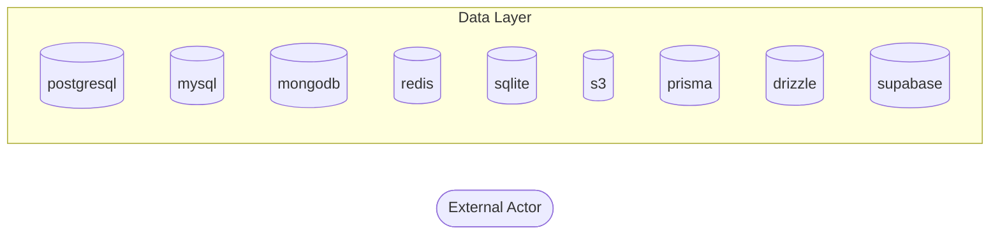

# Threat Model Report

**Generated:** 2026-04-09 12:10:01
**Repository:** /Users/mlieberman/Projects/baseline-mcp
**Frameworks Detected:** None detected

## Executive Summary

⚠️ **1 CRITICAL** threats require immediate attention.
🟡 **8 MEDIUM** severity threats should be reviewed.

| Risk Level | Count |
|------------|-------|
| 🔴 Critical | 1 |
| 🟠 High | 0 |
| 🟡 Medium | 8 |
| 🟢 Low | 0 |
| ℹ️ Info | 0 |

## Asset Inventory

### Entry Points

No API entry points detected.

### Authentication Mechanisms

- **nextauth** (packages/darnit-baseline/src/darnit_baseline/threat_model/patterns.py:97)
  - Assets: session tokens, OAuth credentials, CSRF tokens
- **nextauth** (packages/darnit-baseline/src/darnit_baseline/threat_model/discovery.py:138)
  - Assets: session tokens, OAuth credentials, CSRF tokens
- **nextauth** (packages/darnit-baseline/src/darnit_baseline/threat_model/stride.py:485)
  - Assets: session tokens, OAuth credentials, CSRF tokens

### Data Stores

- **postgresql** (database) - packages/darnit-baseline/src/darnit_baseline/threat_model/patterns.py:300
- **mysql** (database) - packages/darnit-baseline/src/darnit_baseline/threat_model/patterns.py:314
- **mongodb** (database) - packages/darnit-baseline/src/darnit_baseline/threat_model/patterns.py:318
- **redis** (cache) - packages/darnit-baseline/src/darnit_baseline/threat_model/patterns.py:322
- **sqlite** (database) - packages/darnit-baseline/src/darnit_baseline/threat_model/patterns.py:326
- **s3** (external_storage) - packages/darnit-baseline/src/darnit_baseline/threat_model/patterns.py:330
- **prisma** (database) - packages/darnit-baseline/src/darnit_baseline/threat_model/patterns.py:310
- **drizzle** (database) - packages/darnit-baseline/src/darnit_baseline/threat_model/patterns.py:338
- **supabase** (database) - packages/darnit-baseline/src/darnit_baseline/threat_model/patterns.py:107

## Data Flow Diagram

## Threat Analysis (STRIDE)

### Spoofing

No threats identified. Checked for unauthenticated endpoints and missing identity verification.

### Tampering

#### 🟡 TM-T-004: Potential Ssrf Vulnerability

**Risk Score:** 0.48 (MEDIUM)

**Description:** Code pattern suggests potential ssrf vulnerability. Validate URLs against allowlist, block internal IPs

**Attack Vector:** Inject malicious input through user-controlled data

**Exploitation Scenario:**

1. Attacker identifies application functionality that makes outbound HTTP requests
2. Attacker provides a malicious URL pointing to internal services or cloud metadata
3. Application makes a request to the attacker-controlled destination from within the trusted network
4. Attacker accesses internal services, cloud credentials, or pivots to internal systems

**Data Flow Impact:** user-supplied URL → application HTTP client → internal network/cloud metadata → data exfiltration

**Code Locations:**
- `packages/darnit/src/darnit/core/verification.py:396` - CWE-918

**Recommended Controls:**

| Control | Effectiveness | Rationale |
|---------|--------------|-----------|
| Validate and allowlist permitted destination hosts | high | Prevents requests to internal or unauthorized destinations |
| Block requests to private IP ranges and cloud metadata endpoints | high | Prevents the most common SSRF exploitation targets |
| Use a dedicated egress proxy for outbound requests | medium | Centralizes network access control for outbound traffic |

**References:**
- CWE: CWE-918
- OWASP Injection Prevention Cheat Sheet

#### 🟡 TM-T-005: Potential Ssrf Vulnerability

**Risk Score:** 0.48 (MEDIUM)

**Description:** Code pattern suggests potential ssrf vulnerability. Validate URLs against allowlist, block internal IPs

**Attack Vector:** Inject malicious input through user-controlled data

**Exploitation Scenario:**

1. Attacker identifies application functionality that makes outbound HTTP requests
2. Attacker provides a malicious URL pointing to internal services or cloud metadata
3. Application makes a request to the attacker-controlled destination from within the trusted network
4. Attacker accesses internal services, cloud credentials, or pivots to internal systems

**Data Flow Impact:** user-supplied URL → application HTTP client → internal network/cloud metadata → data exfiltration

**Code Locations:**
- `packages/darnit/src/darnit/core/verification.py:447` - CWE-918

**Recommended Controls:**

| Control | Effectiveness | Rationale |
|---------|--------------|-----------|
| Validate and allowlist permitted destination hosts | high | Prevents requests to internal or unauthorized destinations |
| Block requests to private IP ranges and cloud metadata endpoints | high | Prevents the most common SSRF exploitation targets |
| Use a dedicated egress proxy for outbound requests | medium | Centralizes network access control for outbound traffic |

**References:**
- CWE: CWE-918
- OWASP Injection Prevention Cheat Sheet

#### 🟡 TM-T-006: Potential Ssrf Vulnerability

**Risk Score:** 0.48 (MEDIUM)

**Description:** Code pattern suggests potential ssrf vulnerability. Validate URLs against allowlist, block internal IPs

**Attack Vector:** Inject malicious input through user-controlled data

**Exploitation Scenario:**

1. Attacker identifies application functionality that makes outbound HTTP requests
2. Attacker provides a malicious URL pointing to internal services or cloud metadata
3. Application makes a request to the attacker-controlled destination from within the trusted network
4. Attacker accesses internal services, cloud credentials, or pivots to internal systems

**Data Flow Impact:** user-supplied URL → application HTTP client → internal network/cloud metadata → data exfiltration

**Code Locations:**
- `packages/darnit/src/darnit/storage/backends.py:309` - CWE-918

**Recommended Controls:**

| Control | Effectiveness | Rationale |
|---------|--------------|-----------|
| Validate and allowlist permitted destination hosts | high | Prevents requests to internal or unauthorized destinations |
| Block requests to private IP ranges and cloud metadata endpoints | high | Prevents the most common SSRF exploitation targets |
| Use a dedicated egress proxy for outbound requests | medium | Centralizes network access control for outbound traffic |

**References:**
- CWE: CWE-918
- OWASP Injection Prevention Cheat Sheet

#### 🟡 TM-T-007: Potential Ssrf Vulnerability

**Risk Score:** 0.48 (MEDIUM)

**Description:** Code pattern suggests potential ssrf vulnerability. Validate URLs against allowlist, block internal IPs

**Attack Vector:** Inject malicious input through user-controlled data

**Exploitation Scenario:**

1. Attacker identifies application functionality that makes outbound HTTP requests
2. Attacker provides a malicious URL pointing to internal services or cloud metadata
3. Application makes a request to the attacker-controlled destination from within the trusted network
4. Attacker accesses internal services, cloud credentials, or pivots to internal systems

**Data Flow Impact:** user-supplied URL → application HTTP client → internal network/cloud metadata → data exfiltration

**Code Locations:**
- `packages/darnit/src/darnit/storage/backends.py:326` - CWE-918

**Recommended Controls:**

| Control | Effectiveness | Rationale |
|---------|--------------|-----------|
| Validate and allowlist permitted destination hosts | high | Prevents requests to internal or unauthorized destinations |
| Block requests to private IP ranges and cloud metadata endpoints | high | Prevents the most common SSRF exploitation targets |
| Use a dedicated egress proxy for outbound requests | medium | Centralizes network access control for outbound traffic |

**References:**
- CWE: CWE-918
- OWASP Injection Prevention Cheat Sheet

### Repudiation

No threats identified. Checked for insufficient audit logging on security-relevant actions.

### Information Disclosure

#### 🟡 TM-T-002: Potential Xss Vulnerability

**Risk Score:** 0.48 (MEDIUM)

**Description:** Code pattern suggests potential xss vulnerability. Use framework's built-in escaping, avoid raw HTML rendering

**Attack Vector:** Inject malicious input through user-controlled data

**Exploitation Scenario:**

1. Attacker identifies input fields that are reflected in HTML output
2. Attacker injects malicious JavaScript through the vulnerable input
3. Victim's browser executes the injected script in the context of the application
4. Attacker steals session tokens, captures keystrokes, or redirects the victim

**Data Flow Impact:** attacker input → server storage/reflection → victim browser → session/data theft

**Code Locations:**
- `packages/darnit-baseline/src/darnit_baseline/threat_model/patterns.py:227` - CWE-79

**Recommended Controls:**

| Control | Effectiveness | Rationale |
|---------|--------------|-----------|
| Use context-aware output encoding | high | Prevents script execution by encoding special characters for the output context |
| Implement Content Security Policy (CSP) headers | high | Browser-level defense that blocks inline script execution |
| Sanitize user input on ingestion | medium | Reduces attack surface but may miss encoding-specific bypasses |

**References:**
- CWE: CWE-79
- OWASP Injection Prevention Cheat Sheet

#### 🟡 TM-T-003: Potential Xss Vulnerability

**Risk Score:** 0.48 (MEDIUM)

**Description:** Code pattern suggests potential xss vulnerability. Use framework's built-in escaping, avoid raw HTML rendering

**Attack Vector:** Inject malicious input through user-controlled data

**Exploitation Scenario:**

1. Attacker identifies input fields that are reflected in HTML output
2. Attacker injects malicious JavaScript through the vulnerable input
3. Victim's browser executes the injected script in the context of the application
4. Attacker steals session tokens, captures keystrokes, or redirects the victim

**Data Flow Impact:** attacker input → server storage/reflection → victim browser → session/data theft

**Code Locations:**
- `packages/darnit-baseline/src/darnit_baseline/threat_model/patterns.py:229` - CWE-79

**Recommended Controls:**

| Control | Effectiveness | Rationale |
|---------|--------------|-----------|
| Use context-aware output encoding | high | Prevents script execution by encoding special characters for the output context |
| Implement Content Security Policy (CSP) headers | high | Browser-level defense that blocks inline script execution |
| Sanitize user input on ingestion | medium | Reduces attack surface but may miss encoding-specific bypasses |

**References:**
- CWE: CWE-79
- OWASP Injection Prevention Cheat Sheet

#### 🟡 TM-I-008: PII Data Handling Review Required

**Risk Score:** 0.50 (MEDIUM)

**Description:** Found 121 fields that may contain PII. Review data handling, storage, and transmission practices.

**Attack Vector:** Data breach, unauthorized access, logging exposure

**Exploitation Scenario:**

1. Attacker exploits an application vulnerability to gain database or API access
2. Attacker queries or exports personally identifiable information (PII) records
3. PII data is exfiltrated without encryption or access controls in place
4. Exposed individuals face identity theft, fraud, or privacy violations

**Data Flow Impact:** application vulnerability → database/API access → PII extraction → identity theft risk

**Code Locations:**
- `packages/darnit-baseline/src/darnit_baseline/tools.py:484` - PII field: email
- `packages/darnit-baseline/src/darnit_baseline/config/mappings.py:58` - PII field: address
- `packages/darnit-baseline/src/darnit_baseline/config/mappings.py:66` - PII field: address

**Recommended Controls:**

| Control | Effectiveness | Rationale |
|---------|--------------|-----------|
| Encrypt PII at rest and in transit | high | Renders extracted data unusable without encryption keys |
| Implement access logging for PII access | high | Enables detection of unauthorized data access |
| Define data retention policies | medium | Minimizes the amount of PII available for exfiltration |
| Ensure GDPR/CCPA compliance | medium | Provides legal framework for data protection practices |

**References:**
- GDPR Article 32
- OWASP Data Protection Cheat Sheet

#### 🟡 TM-I-009: Financial Data Handling Review Required

**Risk Score:** 0.59 (MEDIUM)

**Description:** Found 15 fields that may contain financial data. Ensure PCI-DSS compliance.

**Attack Vector:** Data breach, unauthorized access

**Exploitation Scenario:**

1. Attacker exploits an application vulnerability to access financial data stores
2. Attacker extracts payment card numbers, bank accounts, or financial records
3. Financial data is used for fraudulent transactions or sold on dark markets
4. Organization faces PCI-DSS non-compliance penalties and financial liability

**Data Flow Impact:** application vulnerability → financial data store → data extraction → financial fraud

**Code Locations:**
- `packages/darnit-baseline/src/darnit_baseline/threat_model/scenarios.py:364` - Financial field: CVV
- `packages/darnit-baseline/src/darnit_baseline/threat_model/scenarios.py:364` - Financial field: CVC
- `packages/darnit-baseline/src/darnit_baseline/threat_model/patterns.py:162` - Financial field: credit_card

**Recommended Controls:**

| Control | Effectiveness | Rationale |
|---------|--------------|-----------|
| Use tokenization for payment card data | high | Replaces sensitive card data with non-reversible tokens |
| Never store CVV/CVC | high | Eliminates the most sensitive card verification data from storage |
| Implement PCI-DSS controls | high | Industry-standard framework for securing financial data |
| Use established payment processors (Stripe, etc.) | medium | Offloads payment data handling to PCI-compliant providers |

**References:**
- PCI-DSS Requirements
- OWASP Payment Security Cheat Sheet

### Denial Of Service

No threats identified. Checked for public endpoints without rate limiting.

### Elevation Of Privilege

#### 🔴 TM-T-001: Potential Command Injection Vulnerability

**Risk Score:** 0.80 (CRITICAL)

**Description:** Code pattern suggests potential command injection vulnerability. Avoid shell execution or use strict input validation

**Attack Vector:** Inject malicious input through user-controlled data

**Code Locations:**
- `packages/darnit-baseline/src/darnit_baseline/threat_model/patterns.py:215` - CWE-78

**Recommended Controls:**
- Avoid shell execution or use strict input validation

**References:**
- CWE: CWE-78
- OWASP Injection Prevention Cheat Sheet

## Attack Chains

No compound attack paths identified.

## Control Gaps

### 🔴 Critical Threat Mitigation

**Gap:** 1 critical/high threats without existing controls

## Recommendations Summary

### Immediate Actions (Critical/High)

1. **Potential Command Injection Vulnerability** - Avoid shell execution or use strict input validation

### Short-term Actions (Medium)

1. **Potential Xss Vulnerability**
2. **Potential Xss Vulnerability**
3. **Potential Ssrf Vulnerability**
4. **Potential Ssrf Vulnerability**
5. **Potential Ssrf Vulnerability**

## Methodology

This threat model was generated using automated static analysis with the STRIDE methodology:

- **S**poofing - Identity verification threats
- **T**ampering - Data integrity threats
- **R**epudiation - Audit and accountability threats
- **I**nformation Disclosure - Confidentiality threats
- **D**enial of Service - Availability threats
- **E**levation of Privilege - Authorization threats

### Limitations

- Static analysis only - runtime behavior not analyzed
- Pattern-based detection may have false positives/negatives
- Business context and risk priorities require human review
- This is not a substitute for professional penetration testing
